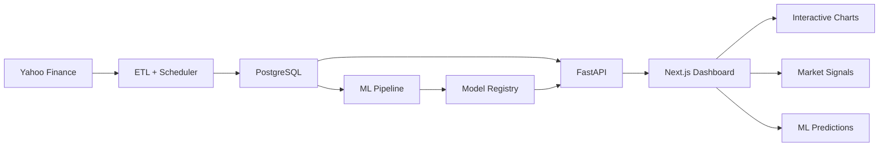
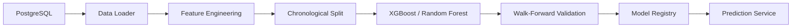

# Financial Market Analytics Platform


An end-to-end financial data science platform that combines data engineering, time-series analysis, feature engineering, machine learning, REST APIs, PostgreSQL, and interactive financial visualization into a production-style application.

The platform collects historical market data through an automated ETL pipeline, stores it in PostgreSQL, generates technical and statistical features, trains machine-learning classification models using chronological walk-forward validation, and exposes analytical results through a FastAPI backend and an interactive Next.js dashboard.

Portfolio project: Machine-learning predictions are experimental analytical signals and should not be interpreted as financial advice or used as a standalone basis for investment decisions.

---

## Table of Contents

- [Project Overview](#project-overview)
- [Dashboard](#dashboard)
- [Key Features](#key-features)
- [System Architecture](#system-architecture)
- [Technology Stack](#technology-stack)
- [Data Pipeline](#data-pipeline)
- [Machine Learning Pipeline](#machine-learning-pipeline)
- [Model Evaluation](#model-evaluation)
- [API](#api)
- [Project Structure](#project-structure)
- [Installation](#installation)
- [Running the Project](#running-the-project)
- [Documentation](#documentation)
- [Limitations](#limitations)
- [Future Improvements](#future-improvements)
- [Skills Demonstrated](#skills-demonstrated)
- [Author](#author)

---

## Project Overview

Financial market data is time-dependent, noisy, and highly sensitive to changing market conditions. A machine-learning model that performs well on historical data may fail when applied to future or unseen market periods.

This project was built to explore that problem through a complete data science and software engineering workflow.

The platform:

1. Collects historical stock-market data.
2. Stores market data in PostgreSQL.
3. Performs data validation and preprocessing.
4. Generates technical and statistical features.
5. Creates future-return-based BUY, HOLD, and SELL targets.
6. Trains machine-learning classification models.
7. Evaluates models using chronological walk-forward validation.
8. Registers trained models and their metadata.
9. Serves predictions through a FastAPI API.
10. Visualizes market data and model outputs through a Next.js dashboard.

The current watchlist includes:

The current market universe includes 30 stocks and ETFs.

---

## Dashboard

The Next.js dashboard provides an interactive interface for exploring historical market behavior, technical indicators, and machine-learning signals.

### Market Visualization

* Interactive candlestick charts
* Historical OHLC price analysis
* Moving-average overlays
* Multi-symbol analysis
* Visual representation of market trends

### Machine-Learning Insights

* BUY / HOLD / SELL market signals
* Machine-learning prediction output
* Prediction probability
* Model confidence
* Current market price

### Real-Time Updates

The dashboard communicates with the FastAPI backend through REST endpoints to retrieve market data, analytics, and machine-learning predictions.

### Supported Market Universe

The dashboard supports the full 30-symbol market universe used by the
data-ingestion and machine-learning pipelines.

The interface allows users to select individual symbols and inspect:

* Historical OHLC price data
* Candlestick charts
* Moving averages
* Market signals
* Machine-learning predictions
* Prediction probability
* Model confidence

---

## Key Features

### Market Data Engineering

* Automated market-data ingestion using yfinance
* Scheduled data collection using APScheduler
* Historical OHLCV data storage
* PostgreSQL persistence
* Data validation and preprocessing
* Multi-symbol support

### Technical Feature Engineering

The feature-engineering pipeline generates indicators and market features including:

* Simple moving averages
* Exponential moving averages
* RSI
* MACD
* Bollinger Bands
* Momentum
* Volatility
* Volume changes
* Candlestick features

### Machine Learning

The platform currently supports:

* XGBoost classification
* Random Forest classification
* BUY / HOLD / SELL prediction
* Prediction probabilities
* Confidence scoring
* Model versioning
* Model registry

### Time-Series Validation

Financial data cannot be evaluated like ordinary independent observations.

The project therefore uses chronological walk-forward validation, where models are trained on earlier observations and evaluated on later unseen periods.

This helps reduce the risk of unrealistic evaluation caused by randomly mixing historical and future observations.

### Backend API

The FastAPI backend provides services for:

* Market data
* OHLC data
* Analytics
* Machine-learning predictions
* Market signals

Interactive Frontend

The Next.js dashboard provides a visual interface for:

* Price movements
* Candlestick patterns
* Technical indicators
* Market signals
* Machine-learning predictions
* Prediction confidence

---

## System Architecture

The platform is organized as an end-to-end data engineering, machine-learning, backend, and frontend system.

### Production Data and Application Flow



### Machine-Learning Training Flow



### End-to-End Workflow

The platform separates data ingestion, model development, and prediction serving into distinct stages:

1. Market Data Collection — Market data is retrieved from Yahoo Finance.
2. ETL Processing — Data is validated, transformed, and stored in PostgreSQL.
3. Feature Engineering — Historical OHLCV data is transformed into technical and statistical features.
4. Model Training and Validation — Machine-learning models are evaluated using chronological walk-forward validation.
5. Model Registry — Trained models and metadata are registered for prediction.
6. Prediction Serving — FastAPI loads the registered model and exposes prediction endpoints.
7. Dashboard Visualization — Next.js consumes the backend services and presents market data and model outputs interactively.
---

## Technology Stack

| Layer | Technology |
|---|---|
| Programming | Python 3.12 |
| Data Processing | Pandas, NumPy |
| Machine Learning | scikit-learn, XGBoost |
| Data Source | Yahoo Finance |
| Database | PostgreSQL |
| Backend | FastAPI |
| Scheduling | APScheduler |
| Frontend | Next.js, React, TypeScript |
| Financial Charts | Lightweight Charts |
| API Communication | REST |
| Environment | Python virtual environment |
| Version Control | Git / GitHub |
---

## Data Pipeline

The data pipeline is responsible for collecting, validating, transforming, and storing market data.

### Pipeline Flow

```text
Yahoo Finance
      │
      ▼
Data Ingestion
      │
      ▼
Validation
      │
      ▼
Transformation
      │
      ▼
PostgreSQL
      │
      ▼
Feature Engineering
```

### ETL Responsibilities

The ETL process:

1. Retrieves market data.
2. Normalizes the data structure.
3. Validates required fields.
4. Identifies duplicate observations.
5. Processes historical and newly available observations.
6. Stores valid records in PostgreSQL.
7. Supports scheduled data updates.

The scheduler automates recurring ingestion so that the platform can maintain an up-to-date market dataset.

---

## Machine Learning Pipeline

The machine-learning workflow transforms historical market observations into predictive features and classification targets.

### Feature Engineering
```

Raw OHLCV data is transformed into features such as:

- Moving Averages
- EMA12 / EMA26
- RSI
- MACD
- Bollinger Bands
- Momentum
- Volatility
- Volume Change
- Candlestick Features

### Prediction Target

The model predicts future market movement over a predefined prediction horizon.

The target is represented as three classes:

| Class | Signal |
|---:|---|
| 0 | SELL |
| 1 | HOLD |
| 2 | BUY |

The classification target is derived from future returns rather than directly predicting the future stock price.

### Model Training

The project currently uses:

* XGBoost
* Random Forest

Models are trained using historical observations and evaluated using chronological walk-forward validation.

### Model Registry

Trained models are versioned and registered with associated metadata.

This provides a structured mechanism for identifying the model used for a particular prediction and supports future model-selection improvements.

---

## Model Evaluation

Model evaluation is performed using chronological walk-forward validation.

Instead of randomly splitting financial observations, the data is divided into sequential training and testing periods.

Conceptually:

Training Data 1 ─────► Test 1
Training Data 1 + 2 ─────────► Test 2
Training Data 1 + 2 + 3 ─────────────► Test 3

This better reflects the real-world scenario in which a model learns from historical data and then makes predictions on future observations.

### Evaluation Metrics

The project evaluates classification performance using multiple complementary metrics:

| Metric | Result |
|---|---:|
| Accuracy | 0.2596 |
| Precision | 0.1724 |
| Recall | 0.2596 |
| F1 Score | 0.1328 |
| ROC-AUC | 0.4954 |

### Interpretation

The current validation results indicate that the models have limited predictive power on unseen market periods. The ROC-AUC score is close to 0.50, suggesting performance near random classification, while the relatively low F1 score indicates difficulty consistently identifying the three market-movement classes.

These results are treated as an experimental baseline rather than evidence of a production-ready investment strategy.

---

## API

The backend is implemented using FastAPI.

The API provides access to market data, analytics, and machine-learning predictions.

### Core API Capabilities

The FastAPI backend provides services for:

- Historical market data
- OHLC price data
- Technical analytics
- Market signals
- Machine-learning predictions

### API Documentation

When the backend is running, FastAPI provides interactive API documentation through:

http://127.0.0.1:8000/docs


---

## Project Structure

```text
financial-market-analytics-platform/
│
├── backend/
│   ├── app/
│   │   ├── api/
│   │   │   ├── analytics.py
│   │   │   ├── etl.py
│   │   │   ├── predictions.py
│   │   │   └── stocks.py
│   │   │
│   │   ├── database/
│   │   │   ├── base.py
│   │   │   └── connection.py
│   │   │
│   │   ├── ml/
│   │   │   ├── algorithms/
│   │   │   ├── core/
│   │   │   ├── evaluation/
│   │   │   ├── registry/
│   │   │   ├── data_loader.py
│   │   │   ├── feature_engineering.py
│   │   │   ├── feature_validator.py
│   │   │   ├── predictor.py
│   │   │   └── train.py
│   │   │
│   │   ├── models/
│   │   ├── schemas/
│   │   ├── services/
│   │   ├── config.py
│   │   └── main.py
│   │
│   ├── init_db.py
│   ├── requirements.txt
│   └── README.md
│
├── frontend/
│   ├── app/
│   │   ├── dashboard/
│   │   ├── globals.css
│   │   ├── layout.tsx
│   │   └── page.tsx
│   ├── components/
│   │   ├── charts/
│   │   └── dashboard/
│   ├── services/
│   ├── public/
│   ├── package.json
│   └── README.md
│
├── docs/
│   └── architecture.md
│
├── README.md
└── .gitignore
```

The repository is organized into separate backend, frontend, and documentation layers. The backend contains the API, database, machine-learning, model, schema, and service components, while the frontend contains the Next.js application and reusable visualization components.

## Installation

1. Clone the repository

git clone https://github.com/saltanikamal/financial-market-analytics-platform.git
cd financial-market-analytics-platform

2. Create and activate the Python environment

python3 -m venv portfolio_venv
source portfolio_venv/bin/activate

3. Install backend dependencies

pip install -r backend/requirements.txt

4. Install frontend dependencies

cd frontend
npm install
cd ..

5. Configure PostgreSQL

Create the required PostgreSQL database and configure the database connection used by the backend.

---

## Running the Project

The application consists of a FastAPI backend and a Next.js frontend.

Start the backend

From the project root:

source portfolio_venv/bin/activate
cd backend
uvicorn app.main:app --reload

The backend will be available at:

http://127.0.0.1:8000

Interactive API documentation:

http://127.0.0.1:8000/docs

Start the frontend

Open another terminal:

cd frontend
npm run dev

The dashboard will be available at:

http://localhost:3000

---

## Documentation

Additional project documentation is available in:

backend/README.md
frontend/README.md
docs/

The documentation covers the backend, frontend, data pipeline, machine-learning workflow, and project architecture.

---

## Limitations

Financial markets are inherently difficult to model.

The current system has several important limitations:

* Historical patterns may not persist into future market conditions.
* Technical indicators do not capture all market information.
* Market behavior can change because of macroeconomic, geopolitical, and unexpected events.
* Classification performance is currently experimental.
* Prediction confidence should not be interpreted as probability of investment success.
* The system does not constitute a validated trading strategy.
* Transaction costs, slippage, liquidity, and portfolio risk management are not fully modeled.

The platform should therefore be viewed as a data science and machine-learning research project, not as an automated investment system.

---

## Future Improvements

Potential future improvements include:

* Improved feature engineering
* Additional market and macroeconomic features
* More robust model-selection strategies
* Expanded walk-forward validation
* Hyperparameter optimization
* Model performance monitoring
* Backtesting and transaction-cost modeling
* Portfolio-level risk analysis
* Improved confidence calibration
* Additional financial instruments
* Advanced deep-learning models such as LSTM
* Cloud deployment
* Automated model retraining and monitoring
* Enhanced dashboard visualization

---

## Skills Demonstrated

This project demonstrates practical experience across the full data science lifecycle:

Data Engineering

* ETL
* Data validation
* PostgreSQL
* Scheduled pipelines

Data Science

* Exploratory analysis
* Time-series feature engineering
* Technical indicators
* Statistical reasoning

### Machine Learning

* Classification
* XGBoost
* Random Forest
* Model evaluation
* Walk-forward validation
* Model versioning

Software Engineering

* Python
* FastAPI
* REST APIs
* Modular project architecture

Frontend Development

* Next.js
* React
* TypeScript
* Interactive financial visualization

Development & Deployment Practices

* Git
* GitHub
* Virtual environments
* API documentation
* Production-style application architecture

---

## Author

Kamal Saltani

Data Scientist | Machine Learning | Data Engineering | Financial Analytics

[GitHub](https://github.com/saltanikamal)
