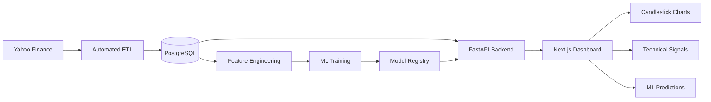

# Financial Market Analytics Platform


An end-to-end financial data science application that integrates automated market-data ingestion, PostgreSQL, feature engineering, time-series machine learning, model evaluation, REST APIs, and interactive financial visualization.

The platform collects historical market data through an automated ETL pipeline, validates and stores the data in PostgreSQL, generates technical and statistical features, trains machine-learning classification models using chronological walk-forward validation, registers model artifacts and evaluation metadata, and exposes analytical results through a FastAPI backend and interactive Next.js dashboard.

### Portfolio Highlights

- **Data Engineering:** Automated ETL, validation, scheduled ingestion, and PostgreSQL persistence.
- **Data Science:** Technical and statistical feature engineering for financial time-series data.
- **Machine Learning:** Random Forest and XGBoost multiclass classification for BUY / HOLD / SELL signals.
- **Time-Series Validation:** Chronological walk-forward validation designed to avoid random mixing of historical and future observations.
- **Model Management:** Versioned model artifacts, evaluation metadata, and metric-based model selection.
- **Backend Engineering:** FastAPI REST services for market data, analytics, predictions, and prediction history.
- **Frontend Engineering:** Next.js, React, TypeScript, and interactive financial visualization.
- **Engineering Practices:** Modular project structure, environment-based configuration, documentation, testing, and Git version control.

> **Portfolio project:** Machine-learning predictions are experimental analytical signals and should not be interpreted as financial advice or used as a standalone basis for investment decisions.

---

## Table of Contents

- [Project Overview](#project-overview)
- [Dashboard](#dashboard)
- [Key Features](#key-features)
- [System Architecture](#system-architecture)
- [Technology Stack](#technology-stack)
- [Data Pipeline](#data-pipeline)
- [Machine Learning Pipeline](#machine-learning-pipeline)
- [Model Evaluation](#model-evaluation)
- [API](#api)
- [Project Structure](#project-structure)
- [Installation](#installation)
- [Running the Project](#running-the-project)
- [Documentation](#documentation)
- [Limitations](#limitations)
- [Future Improvements](#future-improvements)
- [Skills Demonstrated](#skills-demonstrated)
- [Author](#author)

---

## Project Overview

Financial market data is time-dependent, noisy, and highly sensitive to changing market conditions. A machine-learning model that performs well on historical data may fail when applied to future or unseen market periods.

This project was built to explore that problem through a complete data science and software engineering workflow.

The platform:

1. Collects historical stock-market data.
2. Stores market data in PostgreSQL.
3. Performs data validation and preprocessing.
4. Generates technical and statistical features.
5. Creates future-return-based BUY, HOLD, and SELL targets.
6. Trains machine-learning classification models.
7. Evaluates models using chronological walk-forward validation.
8. Registers trained models and their metadata.
9. Serves predictions through a FastAPI API.
10. Visualizes market data and model outputs through a Next.js dashboard.

The data-ingestion pipeline supports a 30-symbol universe of stocks and ETFs:

| Symbol | Company / Instrument |
|---|---|
| AAPL | Apple |
| AMD | Advanced Micro Devices |
| AMZN | Amazon |
| AVGO | Broadcom |
| BAC | Bank of America |
| CAT | Caterpillar |
| COST | Costco |
| CVX | Chevron |
| DIA | SPDR Dow Jones Industrial Average ETF |
| GE | GE Aerospace |
| GOOGL | Alphabet |
| GS | Goldman Sachs |
| HD | Home Depot |
| JNJ | Johnson & Johnson |
| JPM | JPMorgan Chase |
| LLY | Eli Lilly |
| MA | Mastercard |
| META | Meta Platforms |
| MS | Morgan Stanley |
| MSFT | Microsoft |
| NFLX | Netflix |
| NVDA | NVIDIA |
| ORCL | Oracle |
| QQQ | Invesco QQQ ETF |
| SPY | SPDR S&P 500 ETF |
| TSLA | Tesla |
| UNH | UnitedHealth Group |
| V | Visa |
| WMT | Walmart |
| XOM | Exxon Mobil |

The platform supports analysis across the 30-symbol market-data universe, with AAPL, MSFT, NVDA, and SPY currently serving as the primary symbols for the machine-learning workflow and dashboard watchlist.

---

## Dashboard

The Next.js dashboard provides an interactive interface for exploring historical market data, technical indicators, and machine-learning predictions.

### Market Visualization

- Interactive candlestick price charts
- Historical OHLC market data
- Current market price
- Technical market signal based on MA7 versus MA20
- Symbol selection across the supported watchlist
- Responsive chart layout

### Machine-Learning Insights

The dashboard displays the output of the registered machine-learning model for the selected symbol:

- BUY / HOLD / SELL prediction
- Prediction probability
- Prediction confidence score
- Confidence level
- Probability margin
- Model type
- Model version
- Prediction class
- Current market price

### Signal Comparison

The dashboard compares two independent analytical signals:

- **Technical Analysis** — based on the relationship between MA7 and MA20.
- **Machine Learning** — based on the registered classification model.

The dashboard identifies whether the two signals currently **agree** or **diverge**.

This provides a simple way to compare a traditional technical-indicator signal with the machine-learning model output.

### Probability Breakdown

For the multiclass prediction, the dashboard displays the model's probability distribution across:

| Class | Interpretation |
|---|---|
| Bearish | SELL |
| Neutral | HOLD |
| Bullish | BUY |

The probability bars provide a visual representation of the model's relative confidence across the three classes.

### Model Performance

When evaluation metrics are available for the registered model, the dashboard displays:

- Accuracy
- Precision
- Recall
- F1 Score
- ROC-AUC

These metrics describe model evaluation performance and should not be interpreted as the probability that a particular investment will be successful.

### Supported Market Analysis

The underlying platform supports market-data and technical analysis across the 30-symbol market-data universe.

The current dashboard watchlist and primary machine-learning workflow use:

- AAPL
- MSFT
- NVDA
- SPY

The broader platform supports the complete 30-symbol universe documented above.

### Data and Application Updates

The dashboard communicates with the FastAPI backend using:

- **REST API** for historical market data, OHLC analytics, and machine-learning predictions.

---

## Key Features

### Market Data Engineering

* Automated market-data ingestion using yfinance
* Scheduled data collection using APScheduler
* Historical OHLCV data storage
* PostgreSQL persistence
* Data validation and preprocessing
* Multi-symbol support

### Technical Feature Engineering

The feature-engineering pipeline generates indicators and market features including:

* Simple moving averages
* Exponential moving averages
* RSI
* MACD
* Bollinger Bands
* Momentum
* Volatility
* Volume changes
* Candlestick features

### Machine Learning

The platform currently supports:

* XGBoost classification
* Random Forest classification
* BUY / HOLD / SELL prediction
* Prediction probabilities
* Confidence scoring
* Model versioning
* Model registry

### Time-Series Validation

Financial data cannot be evaluated like ordinary independent observations.

The project therefore uses chronological walk-forward validation, where models are trained on earlier observations and evaluated on later unseen periods.

This helps reduce the risk of unrealistic evaluation caused by randomly mixing historical and future observations.

### Backend API

The FastAPI backend provides services for:

* Market data
* OHLC data
* Analytics
* Machine-learning predictions
* Market signals

### Interactive Frontend

The Next.js dashboard provides a visual interface for:

* Price movements
* Candlestick patterns
* Technical indicators
* Market signals
* Machine-learning predictions
* Prediction confidence

---
## System Architecture

The platform is organized as an end-to-end data engineering, machine-learning, backend, and frontend system.

### Production Data and Application Flow


## Technology Stack

| Layer | Technology |
|---|---|
| Programming | Python 3.12 |
| Data Processing | Pandas, NumPy |
| Machine Learning | scikit-learn, XGBoost |
| Data Source | Yahoo Finance |
| Database | PostgreSQL |
| Backend | FastAPI |
| Scheduling | APScheduler |
| Frontend | Next.js, React, TypeScript |
| Financial Charts | Lightweight Charts |
| API Communication | REST |
| Environment | Python virtual environment |
| Version Control | Git / GitHub |

---

## Data Pipeline

The data pipeline is responsible for collecting, validating, transforming, and storing market data.

### Pipeline Flow

```text
Yahoo Finance
      │
      ▼
Data Ingestion
      │
      ▼
Validation
      │
      ▼
Transformation
      │
      ▼
PostgreSQL
      │
      ▼
Feature Engineering
```

### ETL Responsibilities

The ETL process:

1. Retrieves market data.
2. Normalizes the data structure.
3. Validates required fields.
4. Identifies duplicate observations.
5. Processes historical and newly available observations.
6. Stores valid records in PostgreSQL.
7. Supports scheduled data updates.

The scheduler automates recurring ingestion so that the platform can maintain an up-to-date market dataset.

---

## Machine Learning Pipeline

The machine-learning workflow transforms historical market observations into predictive features and classification targets.

### Feature Engineering

Raw OHLCV data is transformed into features such as:

- Moving Averages
- EMA12 / EMA26
- RSI
- MACD
- Bollinger Bands
- Momentum
- Volatility
- Volume Change
- Candlestick Features

### Prediction Target

The model predicts future market movement over a predefined prediction horizon.

The target is represented as three classes:

| Class | Signal |
|---:|---|
| 0 | SELL |
| 1 | HOLD |
| 2 | BUY |

The classification target is derived from future returns rather than directly predicting the future stock price.

### Model Training

The project currently uses:

* XGBoost
* Random Forest

Models are trained using historical observations and evaluated using chronological walk-forward validation.

### Model Registry

Trained models are versioned and registered with associated metadata.

This provides a structured mechanism for validating model artifacts, tracking model versions, and selecting the current model based on registered evaluation metrics.

---

## Model Evaluation

Model evaluation is performed using chronological walk-forward validation.

Instead of randomly splitting financial observations, the data is divided into sequential training and testing periods.

Conceptually:

Training Data 1 ─────► Test 1
Training Data 1 + 2 ─────────► Test 2
Training Data 1 + 2 + 3 ─────────────► Test 3

This better reflects the real-world scenario in which a model learns from historical observations and then makes predictions on future observations.

### Evaluation Metrics

The platform evaluates classification performance using multiple complementary metrics:

| Metric | Description |
|---|---|
| Accuracy | Proportion of correctly classified observations |
| Precision | Proportion of predicted classes that were correct |
| Recall | Proportion of actual classes correctly identified |
| F1 Score | Harmonic mean of precision and recall |
| ROC-AUC | Ability of the classifier to distinguish between classes |

### Latest Model Evaluation Results

The latest registered models for the primary dashboard watchlist are XGBoost classifiers evaluated using historical market data.

| Symbol | Model | Accuracy | Precision | Recall | F1 | ROC-AUC |
|---|---|---:|---:|---:|---:|---:|
| AAPL | XGBoost | 0.2464 | 0.4623 | 0.2464 | 0.1160 | 0.5341 |
| MSFT | XGBoost | 0.4306 | 0.4328 | 0.4306 | 0.4177 | 0.5741 |
| NVDA | XGBoost | 0.3923 | 0.3955 | 0.3923 | 0.3713 | 0.5720 |
| SPY | XGBoost | 0.7129 | 0.5083 | 0.7129 | 0.5934 | 0.5497 |

### Registered Model Versions

| Symbol | Model Version |
|---|---|
| AAPL | 20260818_114727 |
| MSFT | 20260818_114825 |
| NVDA | 20260818_114840 |
| SPY | 20260818_114858 |

### Model Selection

The model registry selects the current model using a two-stage process.

First, only model files that exist on disk are considered, and the newest registered version of each model type is retained. This prevents stale or missing historical models from being selected.

Among the current valid models, selection is based on:

1. Highest F1 score
2. Highest accuracy as a tie-breaker
3. Newest model version as a final tie-breaker

This approach prioritizes balanced classification performance while ensuring that model selection uses valid, current artifacts.

For example, the DIA registry currently contains both XGBoost and Random Forest models. Their F1 scores are extremely close:

| Model | F1 | Accuracy | ROC-AUC |
|---|---:|---:|---:|
| Random Forest | 0.6951 | 0.7783 | 0.7466 |
| XGBoost | 0.6942 | 0.7877 | 0.6044 |

Because Random Forest has the slightly higher F1 score, it is selected by the registry despite XGBoost having slightly higher accuracy. This illustrates why the platform does not rely on accuracy alone for model selection.

### Interpretation

Model performance varies substantially across financial instruments.

SPY currently has the strongest validation results among the four primary dashboard symbols, with an accuracy of approximately 71.3% and an F1 score of approximately 0.593. MSFT and NVDA show moderate performance, while AAPL has substantially weaker validation results.

The ROC-AUC values range from approximately 0.53 to 0.57. These values indicate limited class-separation ability and should not be interpreted as evidence of strong predictive power.

The relatively low F1 score for AAPL is particularly important because accuracy alone can be misleading in a multi-class classification problem.

### Important Model Limitation

These machine-learning results are experimental portfolio-project results and should not be interpreted as evidence of a profitable trading strategy.

Financial markets are noisy, non-stationary, and difficult to predict consistently. Model confidence represents the classifier's output based on its probability distribution; it does **not** represent the probability that a trade will be profitable.

The current results are therefore presented as a transparent baseline for evaluating the machine-learning pipeline and identifying opportunities for future improvement.

Potential future improvements include:

- Additional feature engineering
- Hyperparameter optimization
- Improved class handling
- Alternative validation windows
- Model calibration
- Additional machine-learning algorithms
- More robust out-of-sample testing
- Comparison against simple baseline strategies

### Relationship Between Validation and Dashboard Predictions

The dashboard separates two analytical layers:

1. **Technical Analysis** — rule-based signals derived from indicators such as MA7 and MA20.
2. **Machine Learning** — three-class predictions generated by the registered classification model.

Agreement between these layers is not treated as proof of predictive accuracy. Instead, the dashboard displays agreement or divergence to make the analytical process transparent.

A model can produce a high-confidence prediction while still having relatively weak historical validation performance. This distinction is intentional and is documented directly in the dashboard.

---

## API

The backend is implemented using FastAPI.

The API provides access to market data, analytics, and machine-learning predictions.

### Core API Capabilities

The FastAPI backend provides services for:

- Historical market data
- OHLC price data
- Technical analytics
- Market signals
- Machine-learning predictions

### API Endpoints

| Method | Endpoint | Purpose |
|---|---|---|
| GET | `/` | API root |
| GET | `/stocks` | Return available stock symbols |
| GET | `/analytics/ohlc/{symbol}` | Return historical OHLC data and technical features |
| GET | `/predict/{symbol}` | Generate and store a machine-learning prediction |
| GET | `/predict/history/{symbol}` | Retrieve stored prediction history |
| GET | `/etl/{symbol}` | Run market-data ETL for a symbol |

### API Documentation

When the backend is running, FastAPI provides interactive API documentation through:

http://127.0.0.1:8000/docs

---

## Project Structure

```text
financial-market-analytics-platform/
│
├── backend/
│   ├── app/
│   │   ├── api/
│   │   │   ├── analytics.py
│   │   │   ├── etl.py
│   │   │   ├── predictions.py
│   │   │   └── stocks.py
│   │   │
│   │   ├── database/
│   │   │   ├── base.py
│   │   │   └── connection.py
│   │   │
│   │   ├── ml/
│   │   │   ├── algorithms/
│   │   │   ├── core/
│   │   │   ├── evaluation/
│   │   │   ├── registry/
│   │   │   ├── data_loader.py
│   │   │   ├── feature_engineering.py
│   │   │   ├── feature_validator.py
│   │   │   ├── predictor.py
│   │   │   └── train.py
│   │   │
│   │   ├── models/
│   │   ├── schemas/
│   │   ├── services/
│   │   ├── config.py
│   │   └── main.py
│   │
│   ├── init_db.py
│   ├── requirements.txt
│   └── README.md
│
├── frontend/
│   ├── app/
│   │   ├── dashboard/
│   │   ├── globals.css
│   │   ├── layout.tsx
│   │   └── page.tsx
│   ├── components/
│   │   ├── charts/
│   │   └── dashboard/
│   ├── services/
│   ├── public/
│   ├── package.json
│   └── README.md
│
├── docs/
│   └── architecture.md
│
├── README.md
└── .gitignore
```

The repository is organized into separate backend, frontend, and documentation layers. The backend contains the API, database, machine-learning, model, schema, and service components, while the frontend contains the Next.js application and reusable visualization components.

## Installation

1. Clone the repository

git clone https://github.com/saltanikamal/financial-market-analytics-platform.git
cd financial-market-analytics-platform

2. Create and activate the Python environment

python3 -m venv portfolio_venv
source portfolio_venv/bin/activate

3. Install backend dependencies

pip install -r backend/requirements.txt

4. Install frontend dependencies

cd frontend
npm install
cd ..

5. Configure PostgreSQL

Create the required PostgreSQL database and configure the database connection used by the backend.

---

## Running the Project

The application consists of a FastAPI backend and a Next.js frontend.

Start the backend

From the project root:

source portfolio_venv/bin/activate
cd backend
uvicorn app.main:app --reload

The backend will be available at:

http://127.0.0.1:8000

Interactive API documentation:

http://127.0.0.1:8000/docs

Start the frontend

Open another terminal:

cd frontend
npm run dev

The dashboard will be available at:

http://localhost:3000

---

## Documentation

The repository includes additional documentation for the major components of the platform:

| Documentation | Description |
|---|---|
| [System Architecture](docs/architecture.md) | High-level platform architecture and component relationships |
| [Backend](backend/docs/backend.md) | FastAPI services, endpoints, and backend design |
| [Database](backend/docs/database.md) | PostgreSQL schema, data storage, and database design |
| [ML Pipeline](backend/docs/ml-pipeline.md) | Feature engineering, model training, validation, and evaluation |
| [Backend Architecture](backend/docs/system-architecture.md) | Backend-specific architecture and data flow |
| [Backend README](backend/README.md) | Backend setup and development instructions |
| [Frontend Documentation](frontend/docs/frontend.md) | Comprehensive Next.js, React, TypeScript, dashboard, visualization, and frontend architecture documentation |
| [Frontend README](frontend/README.md) | Next.js dashboard setup and development instructions |

---


## Limitations

Financial markets are inherently difficult to model.

The current system has several important limitations:

* Historical patterns may not persist into future market conditions.
* Technical indicators do not capture all market information.
* Market behavior can change because of macroeconomic, geopolitical, and unexpected events.
* Classification performance is currently experimental.
* Prediction confidence should not be interpreted as probability of investment success.
* The system does not constitute a validated trading strategy.
* Transaction costs, slippage, liquidity, and portfolio risk management are not fully modeled.

The platform should therefore be viewed as a data science and machine-learning research project, not as an automated investment system.

---

## Future Improvements

Potential future improvements include:

* Improved feature engineering
* Additional market and macroeconomic features
* More robust model-selection strategies
* Expanded walk-forward validation
* Hyperparameter optimization
* Model performance monitoring
* Backtesting and transaction-cost modeling
* Portfolio-level risk analysis
* Improved confidence calibration
* Additional financial instruments
* Advanced deep-learning models such as LSTM
* Cloud deployment
* Automated model retraining and monitoring
* Enhanced dashboard visualization

---

## Skills Demonstrated

This project demonstrates practical experience across the full data science lifecycle:

Data Engineering

* ETL
* Data validation
* PostgreSQL
* Scheduled pipelines

Data Science

* Exploratory analysis
* Time-series feature engineering
* Technical indicators
* Statistical reasoning

### Machine Learning

* Classification
* XGBoost
* Random Forest
* Model evaluation
* Walk-forward validation
* Model versioning

Software Engineering

* Python
* FastAPI
* REST APIs
* Modular project architecture

Frontend Development

* Next.js
* React
* TypeScript
* Interactive financial visualization

Development & Deployment Practices

* Git
* GitHub
* Virtual environments
* API documentation
* Professional application architecture

---

## Author

Kamal Saltani

Data Scientist | Machine Learning | Data Engineering | Financial Analytics

[GitHub](https://github.com/saltanikamal)
