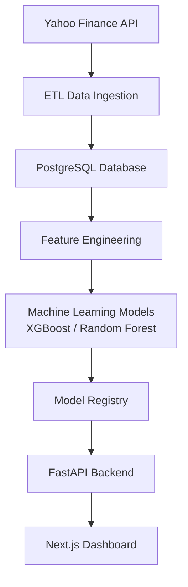
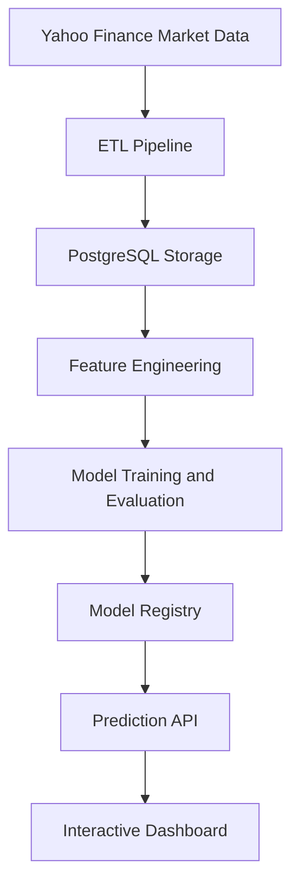

# System Architecture

## Overview

The Financial Market Analytics Platform follows an end-to-end data science architecture combining data ingestion, database storage, machine learning, backend services, and frontend visualization.

The platform integrates financial data collection, feature engineering, machine learning model training, prediction services, and interactive visualization into a modular architecture.

---

## Architecture Flow

---

## System Components

### 1. Data Ingestion Layer

The data ingestion layer is responsible for collecting historical financial market data from external sources and preparing it for storage.

#### Responsibilities

- Retrieve OHLCV market data from Yahoo Finance.
- Support multiple stock symbols.
- Automate scheduled data updates.
- Prevent duplicate records during ingestion.

#### Technologies

- Python
- yfinance
- APScheduler

---

### 2. Database Layer

The database layer provides persistent storage for historical market data and serves as the foundation for analytics and machine learning workflows.

#### Responsibilities

- Store historical OHLCV market data.
- Maintain structured financial datasets.
- Provide data access for analytics and model training.
- Ensure reliable storage of processed market information.

#### Technology

- PostgreSQL

The database acts as the central storage layer connecting data ingestion, feature engineering, analytics, and machine learning components.

---

### 3. Feature Engineering Layer

The feature engineering layer transforms raw market data into machine-learning-ready features. This stage converts historical price and volume information into meaningful indicators that help models identify patterns in market behavior.

#### Responsibilities

- Clean and prepare historical market data.
- Generate technical indicators.
- Create features for machine learning models.
- Prepare training datasets.

#### Generated Features

The platform creates more than 30 financial features, including:

- Daily returns
- Moving averages (MA7, MA20, MA50, MA100, MA200)
- Exponential moving averages (EMA12, EMA26)
- Relative Strength Index (RSI)
- MACD
- Bollinger Bands
- Momentum indicators
- Volatility measures
- Volume-based features
- Candlestick features

These engineered features are used as inputs for the machine learning classification models.

---

### 4. Machine Learning Layer

The machine learning layer is responsible for training and generating market direction predictions using engineered financial features.

The platform treats prediction as a multiclass classification problem, where models classify future market movements into BUY, HOLD, and SELL signals.

#### Responsibilities

- Train machine learning models using engineered financial features.
- Evaluate model performance using time-series validation.
- Generate market direction predictions.
- Manage model versions.

#### Models Implemented

- XGBoost Classifier
- Random Forest Classifier

#### Prediction Classes

| Class | Signal |
|------|--------|
| 0 | SELL |
| 1 | HOLD |
| 2 | BUY |

#### Model Evaluation

Because financial data is time-dependent, traditional random train/test splitting is avoided.

The platform uses:

- Walk-forward validation
- Time-series evaluation
- Historical backtesting approach

This helps reduce data leakage and provides a more realistic evaluation of model performance.

---

### 5. Model Registry Layer

The model registry layer manages trained machine learning models and their associated metadata throughout the model lifecycle.

It provides a structured approach for storing, tracking, and selecting models used for generating predictions.

#### Responsibilities

- Store trained model versions.
- Track model metadata and training information.
- Maintain model history.
- Select the appropriate model for prediction.

#### Stored Information

The registry tracks:

- Model type
- Model version
- Training timestamp
- Feature set
- Evaluation metrics
- Model file location

The model registry enables reproducibility and supports future model comparison and improvement.

---

### 6. FastAPI Backend Layer

The backend layer provides REST API services that connect the machine learning pipeline and database with the frontend dashboard.

The FastAPI application acts as the service layer responsible for retrieving financial data, generating predictions, and exposing analytics results.

#### Responsibilities

- Provide REST API endpoints.
- Retrieve historical market data.
- Serve machine learning predictions.
- Connect backend services with the frontend application.
- Return structured JSON responses.

#### Main Services

The backend provides:

- Historical OHLC market data
- Technical indicator data
- BUY/HOLD/SELL predictions
- Model confidence information

#### Example API Endpoints

| Endpoint | Description |
|----------|-------------|
| `/analytics/ohlc/{symbol}` | Retrieve historical OHLC data |
| `/predict/{symbol}` | Generate market prediction |
| `/stocks` | Retrieve available symbols |

The FastAPI layer separates the machine learning logic from the user interface, allowing the prediction system to be accessed by multiple clients.

---

### 7. Frontend Visualization Layer

The frontend layer provides an interactive user interface for exploring financial market data, technical indicators, and machine learning predictions.

The dashboard communicates with the FastAPI backend to retrieve market analytics and display model outputs in a user-friendly format.

#### Responsibilities

- Visualize historical price movements.
- Display technical indicators.
- Present machine learning predictions.
- Provide interactive market exploration.

#### Technologies

- Next.js
- React
- TypeScript
- Lightweight Charts

#### Dashboard Features

The dashboard includes:

- Candlestick charts
- Moving averages
- Technical indicators
- Stock symbol selection
- BUY/HOLD/SELL prediction display
- Market analytics visualization

The frontend layer provides the final interface between the analytical platform and the end user.

---

## Data Flow

The platform follows a sequential data pipeline where financial market data moves from external sources through storage, processing, machine learning, and visualization layers.

---

## Design Principles

The platform was designed using software engineering and machine learning best practices to create a modular, maintainable, and extensible system.

### Modular Architecture

Each component is separated into independent layers:

- Data ingestion
- Database storage
- Feature engineering
- Machine learning
- Backend services
- Frontend visualization

This separation allows individual components to be modified, tested, and improved without affecting the entire system.

### Separation of Concerns

Each layer has a specific responsibility:

- ETL handles data collection.
- PostgreSQL manages storage.
- Feature engineering prepares model inputs.
- Machine learning handles prediction.
- FastAPI provides services.
- Next.js handles visualization.

This improves maintainability and makes the system easier to extend.

### Reproducibility

The platform tracks machine learning models through a model registry containing:

- Model versions
- Training metadata
- Evaluation metrics
- Feature information

This supports reproducible experiments and future model comparisons.

### Scalability

The architecture allows future expansion:

- Additional financial instruments
- New machine learning models
- Additional data sources
- Cloud deployment
- Real-time market data processing

---

## Future Improvements

The current architecture provides a foundation for a production-grade financial analytics platform. Future enhancements can improve scalability, reliability, and modeling capabilities.

### Cloud Deployment

Deploy the platform to cloud infrastructure to improve accessibility and scalability.

Potential improvements:

- AWS infrastructure deployment
- Managed PostgreSQL database
- Cloud-based model hosting
- Automated CI/CD pipelines

### Real-Time Market Data

Extend the platform from historical analysis to real-time monitoring.

Possible additions:

- Live market data streaming
- WebSocket-based updates
- Real-time prediction generation
- Event-driven data processing

### Advanced Machine Learning Models

Expand the modeling pipeline with additional approaches:

- LSTM neural networks for time-series modeling
- Transformer-based architectures
- Ensemble modeling techniques
- Hyperparameter optimization

### Model Monitoring

Introduce machine learning operations (MLOps) capabilities:

- Model performance tracking
- Prediction drift detection
- Automated retraining workflows
- Model quality monitoring

### Portfolio Analytics

Extend beyond individual stock prediction:

- Portfolio optimization
- Risk analysis
- Asset allocation strategies
- Performance benchmarking
